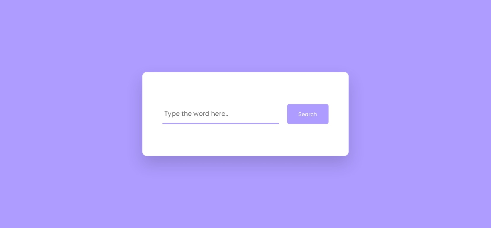
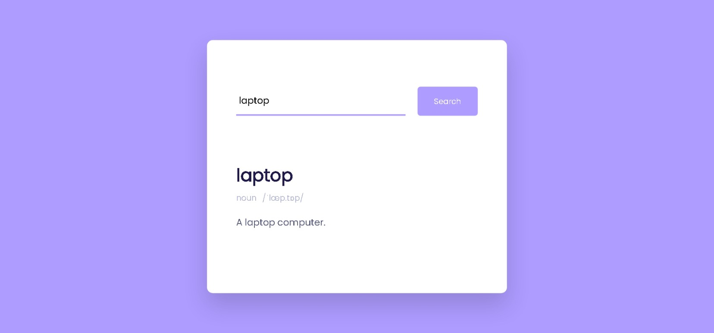
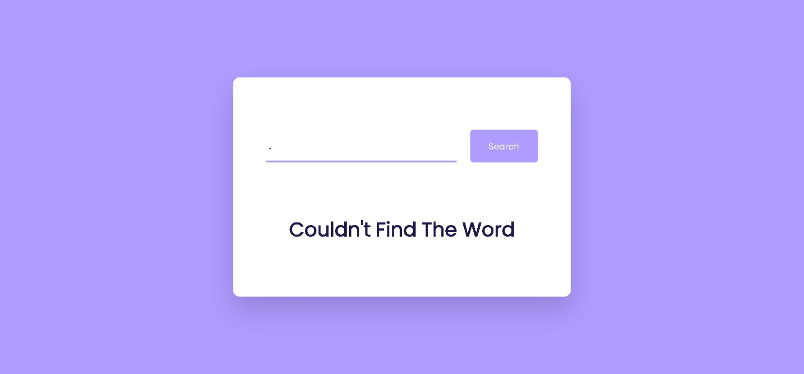

<h1>Dictionary Application</h1>

A simple dictionary application that provides definitions and pronunciations of words using the DictionaryAPI.

<h2>Table of Contents</h2>
<ul>
    <li><a href="#features">Features</a></li>
    <li><a href="#technologies">Technologies</a></li>
    <li><a href="#screenshots">Screenshots</a></li>
    <li><a href="#installation">Installation</a></li>
    <li><a href="#contributing">Contributing</a></li>
    <li><a href="#contact">Contact</a></li>
</ul>

<h2 id="features">Features</h2>
<ul>
    <li>Search for any word and retrieve its meaning, pronunciation, and whether it's a noun or verb.</li>
    <li>Display example sentences for the word's usage.</li>
    <li>Responsive design for mobile and desktop.</li>
</ul>

<h2 id="technologies">Technologies</h2>
<ul>
    <li>HTML</li>
    <li>CSS</li>
    <li>JavaScript</li>
    <li>DictionaryAPI</li>
</ul>

<h2 id="screenshots">Screenshots</h2>

<h2 id="installation">Installation</h2>
<ol>
    <li>Clone the repository: <code>git clone https://github.com/chihebabiza/Dictionary.git</code></li>
    <li>Navigate to the project directory: <code>cd Dictionary</code></li>
    <li>Open <code>index.html</code> in your web browser.</li>
</ol>

<h2 id="contributing">Contributing</h2>

For support or questions about the application, please contact <a href="mailto:chihababiza9@gmail.com" target="_blank">chihababiza9@gmail.com</a>.

<h2 id="contact">Contact</h2>

For any inquiries or collaboration opportunities, feel free to contact me via email at <a href="mailto:chihababiza9@gmail.com" target="_blank">chihababiza9@gmail.com</a> or reach out to me on Instagram <a href="https://www.instagram.com/chiheb_abiza_/" target="_blank">@chiheb_abiza_</a>.

